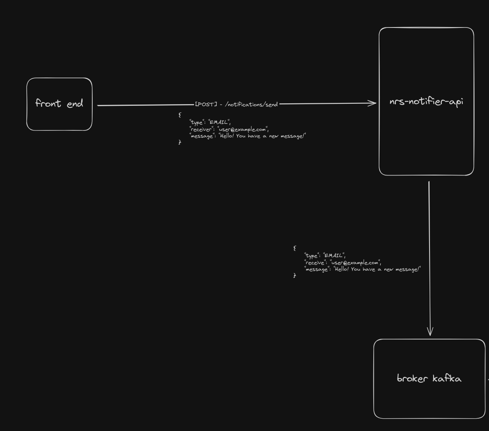

# 📌 nrs-notifier-api

O objetivo dessa API é enviar informações para o tópico kafka de notificações. Essas informações serão fornecidas através 
de requisições HTTP, nessas requisições <strong>precisam</strong> ter os seguintes dados:
- type: o meio que será enviado a notificação (apenas 'EMAIL' por enquanto)
- receiver: o receptor da mensagem
- message: a mensagem que será enviada

## 🚀 Tecnologias
- Java 21
- Spring framework
- Apache Kafka
- Docker (opcional)

## ⚙️ Como executar

### Pré-requisitos
> 💡 Dica: Recomendo utilizar o [sdkman](https://sdkman.io/) para realizar as insatações do java e maven para centralizar
> o versionamento/gerenciamento do java e do maven em um lugar só.

- Java 21
- Maven 3.9.3+
- Kafka 3.4.0 (recomendo utilizar o que está localizado na pasta local-setup)

### Executando localmente

- Clone o repositório
  ``` shell
    git clone git@github.com:neresdev/nrs-notifier-api.git
  ```
<br />

- Vá até a pasta da aplicação
  ```shell
    cd nrs-notifier-api  
  ```

<br />

- Execute o build da aplicação para instalar as dependências necessárias (necessário estar com o maven e suas respectivas
variáveis configuradas, como a `MAVEN_HOME`)
  ```shell
    mvn clean install  
  ```
<br />

- Execute a aplicação
  ```shell
    mvn spring-boot:run  
  ```
  
### Iniciando o kafka
```shell
    # iniciar zookeeper
    sudo /usr/local/kafka/bin/zookeeper-server-start.sh /usr/local/kafka/config/zookeeper.properties

    # iniciar o primeiro broker kafka
    sudo /usr/local/kafka/bin/kafka-server-start.sh /usr/local/kafka/config/server.properties
    
    # iniciar o segundo broker kafka
    sudo /usr/local/kafka/bin/kafka-server-start.sh /usr/local/kafka/config/server2.properties
    
    # criar o tópico kafka para enviar as notificações de e-mail
    sudo /usr/local/kafka/bin/kafka-topics.sh --create --topic email-notifications --bootstrap-server localhost:9092 --partitions 2 --replication-factor 2
    
    # opcional consumidor para o tópico de notificações por e-mail
    sudo /usr/local/kafka/bin/kafka-console-consumer.sh --bootstrap-server localhost:9092 --topic email-notifications --from-beginning
      

```
### Exemplo de requisições
```shell
    # Executar 
    curl --request POST \
      --url http://localhost:8081/send-message \
      --header 'Content-Type: application/json' \
      --header 'User-Agent: insomnia/10.3.1' \
      --data '{
        "type": "EMAIL",
        "receiver": "neresdev@gmail.com",
        "message": "mensagem do readme"
    }'
```

### Workflow (ou system design) da aplicação
